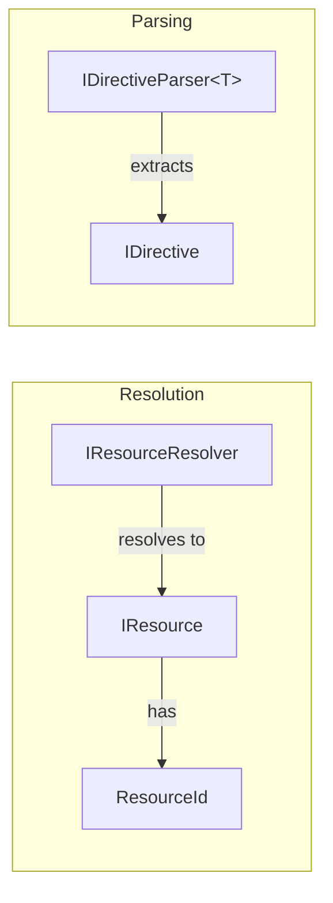

# Core Abstractions Architecture

This document describes the foundational types that form the backbone of TinyPreprocessor.

## Overview

The core abstractions define how resources are identified, represented, parsed, and resolved. These types are intentionally minimal and abstract to allow downstream users maximum flexibility.

## Types

### ResourceId

A lightweight, immutable identifier for resources in the preprocessing system.

```csharp
public readonly struct ResourceId : IEquatable<ResourceId>
{
    public string Path { get; }
}
```

**Design Decisions:**

- **Readonly struct**: Zero-allocation equality checks, value semantics
- **String-based path**: Flexible enough for file paths, URIs, or abstract identifiers
- **IEquatable<ResourceId>**: Enables efficient dictionary lookups and hash set operations
- **Implicit conversion from string**: Convenient API for simple cases

**Usage:**

```csharp
ResourceId id = "path/to/resource.txt";
ResourceId id2 = new ResourceId("path/to/resource.txt");
```

---

### IResource

Represents a single resource (file, module, or abstract content unit) in the preprocessing pipeline.

```csharp
public interface IResource
{
    ResourceId Id { get; }
    ReadOnlyMemory<char> Content { get; }
    IReadOnlyDictionary<string, object>? Metadata { get; }
}
```

**Design Decisions:**

- **Interface**: Allows custom resource implementations (lazy-loaded, cached, virtual, etc.)
- **ReadOnlyMemory<char>**: Efficient slicing without allocations, spans for processing

- **Nullable Metadata**: Optional extensibility point for custom data (timestamps, checksums, etc.)

**Default Implementation:**

```csharp
public sealed record Resource(
    ResourceId Id,
    ReadOnlyMemory<char> Content,
    IReadOnlyDictionary<string, object>? Metadata = null
) : IResource;
```

---

### IDirective

Marker interface for parsed directives found within resource content.

```csharp
public interface IDirective
{
    Range Location { get; }

}
```

**Design Decisions:**

- **Marker interface**: Downstream users define their own directive types (IncludeDirective, ImportDirective, etc.)
- **Range Location**: Uses System.Range for efficient content slicing; indicates where the directive appears in source
- **No reference property**: The meaning of "what to include" is directive-specific

**Example Implementation:**

```csharp
public sealed record IncludeDirective(string Reference, Range Location) : IDirective;
public sealed record ImportDirective(string Module, bool IsRelative, Range Location) : IDirective;
```

---

### IResourceResolver

Resolves string references (from directives) into actual resources.

```csharp
public interface IResourceResolver
{
    ValueTask<ResourceResolutionResult> ResolveAsync(
        string reference,

        IResource? relativeTo,
        CancellationToken ct);
}
```

**Design Decisions:**

- **Async-first (ValueTask)**: Resolution may involve I/O (file system, network, database)
- **relativeTo parameter**: Enables relative path resolution from the including resource
- **Returns result object**: Separates success/failure without exceptions for expected failures

**ResourceResolutionResult:**

```csharp
public sealed record ResourceResolutionResult(
    IResource? Resource,
    IPreprocessorDiagnostic? Error)
{
    public bool IsSuccess => Resource is not null;

    public static ResourceResolutionResult Success(IResource resource)
        => new(resource, null);

    public static ResourceResolutionResult Failure(IPreprocessorDiagnostic error)
        => new(null, error);
}
```

---

### IDirectiveParser<TDirective>

Extracts directives from resource content.

```csharp
public interface IDirectiveParser<TDirective> where TDirective : IDirective
{
    IEnumerable<TDirective> Parse(ReadOnlyMemory<char> content, ResourceId resourceId);
}
```

**Design Decisions:**

- **Generic TDirective**: Type-safe parsing for specific directive types
- **IEnumerable return**: Lazy evaluation, allows streaming large files
- **ResourceId parameter**: Enables context-aware parsing and better error messages
- **Sync API**: Parsing is CPU-bound; async would add overhead without benefit

**Example Implementation:**

```csharp
public sealed class CStyleIncludeParser : IDirectiveParser<IncludeDirective>
{
    // Parses: #include "path" or #include <path>
    public IEnumerable<IncludeDirective> Parse(ReadOnlyMemory<char> content, ResourceId resourceId)
    {
        // Implementation using Regex or manual parsing
    }
}
```

---

## Relationships



## Thread Safety

- **ResourceId**: Immutable, fully thread-safe
- **IResource**: Implementations should be immutable or document thread-safety
- **IResourceResolver**: Implementations should be thread-safe for concurrent resolution
- **IDirectiveParser**: Stateless by design, inherently thread-safe

## Extension Points

1. **Custom Resource Types**: Implement `IResource` for lazy loading, caching, or virtual resources
2. **Custom Directives**: Define directive records implementing `IDirective`
3. **Custom Parsers**: Implement `IDirectiveParser<T>` for different syntax styles
4. **Custom Resolvers**: Implement `IResourceResolver` for file systems, databases, or network resources
