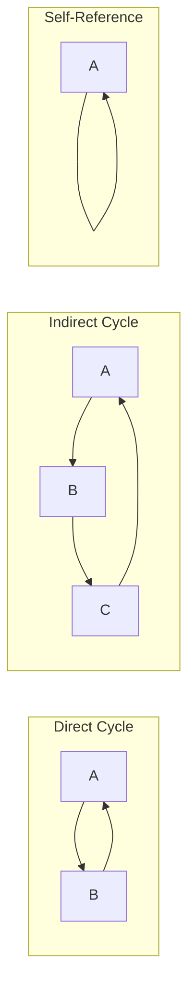
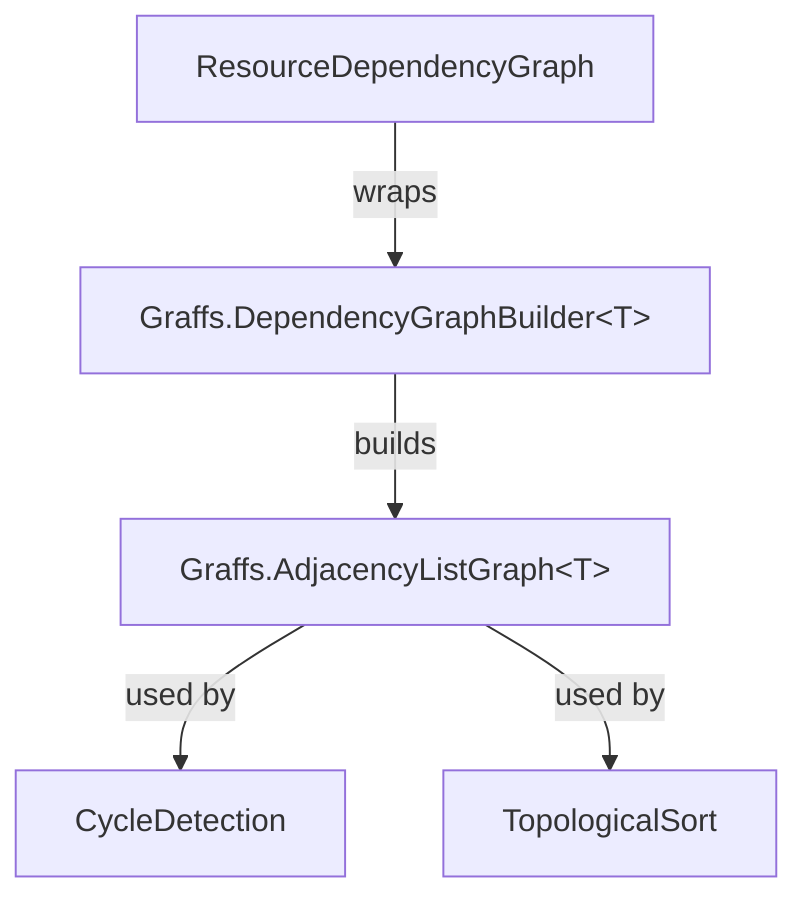

# Dependency Graph Architecture

This document describes the dependency graph system that tracks resource relationships and enables cycle detection and topological ordering.

## Overview

The dependency graph layer wraps the **Graffs** library to manage resource dependencies. It provides cycle detection (to identify circular includes) and topological sorting (to determine correct processing order).

## Graffs Integration

TinyPreprocessor uses Graffs 0.1.0 for graph operations. Key Graffs types used:

- `DependencyGraphBuilder<T>`: Fluent builder with `.DependsOn(dependent, dependency)` semantics
- `AdjacencyListGraph<T>`: Sparse graph implementation (optimal for typical include graphs)
- `CycleDetection`: Johnson's algorithm for finding all cycles
- `TopologicalSort`: Kahn's algorithm for BFS-based topological ordering

## Types

### ResourceDependencyGraph

Manages the dependency relationships between resources.

```
class ResourceDependencyGraph
    // Wraps Graffs.DependencyGraphBuilder<ResourceId> internally

    Methods:
        AddResource(id)                    → register isolated node
        AddDependency(dependent, dependency) → record "A depends on B"

        DetectCycles()         → List<List<ResourceId>>  // all cycles found
        HasCycles()            → bool                    // fast check
        GetProcessingOrder()   → List<ResourceId>        // topological sort (deps first)

        GetDependencies(id)    → Set<ResourceId>         // what does id depend on?
        GetDependents(id)      → Set<ResourceId>         // what depends on id?
        GetAllResources()      → Set<ResourceId>         // all registered nodes
```

**Design Decisions:**

- **Wraps Graffs**: Provides TinyPreprocessor-specific API while leveraging proven algorithms
- **Lazy graph building**: `Build()` called on each query; efficient for typical use (build once, query few times)
- **DependsOn semantics**: Matches natural "A includes B" → "A depends on B" mental model
- **HashSet for nodes**: Ensures isolated nodes (no dependencies) are tracked

---

## Dependency Direction

Understanding the direction is crucial:


**Graph edges (DependsOn):**

- `main → utils` (main depends on utils)
- `utils → types` (utils depends on types)

**Topological order (dependencies first):**

- `[types, utils, main]`

This order ensures that when processing `main`, both `utils` and `types` have already been processed.

---

## Cycle Detection

### What Constitutes a Cycle



### Cycle Reporting

When cycles are detected, they're converted to `CircularDependencyDiagnostic`:

```
function DetectCyclesAsDiagnostics() → IEnumerable<CircularDependencyDiagnostic>
    for each cycle in DetectCycles():
        displayCycle = cycle + [cycle[0]]  // append first to show closure
        yield CircularDependencyDiagnostic(displayCycle)
```

**Output format:**

```
TPP0001: Circular dependency detected: A.txt → B.txt → C.txt → A.txt
```

---

## Topological Ordering

### Kahn's Algorithm

Graffs uses Kahn's algorithm (BFS-based) for topological sorting:

1. Find all nodes with no incoming edges (no dependents)
2. Add them to result, remove their outgoing edges
3. Repeat until graph is empty
4. If nodes remain, graph has cycles

### Processing Order Example

```
// Given dependency structure:
//   main includes header, utils
//   utils includes types
//   header includes types

graph.AddDependency("main", "header")
graph.AddDependency("main", "utils")
graph.AddDependency("utils", "types")
graph.AddDependency("header", "types")

order = graph.GetProcessingOrder()
// Result: [types, header, utils, main]
// or:     [types, utils, header, main]
// (header and utils are interchangeable since neither depends on the other)
```

---

## Usage in Preprocessor

```
// 1. Build graph during resolution phase
graph = new ResourceDependencyGraph()

function ResolveRecursive(resource, depth)
    graph.AddResource(resource.Id)

    directives = parser.Parse(resource.Content, resource.Id)
    for each directive in directives:
        result = await resolver.ResolveAsync(directive.Reference, resource, ct)
        if result.IsSuccess:
            graph.AddDependency(resource.Id, result.Resource.Id)
            await ResolveRecursive(result.Resource, depth + 1)

// 2. Detect cycles before processing
for each cycle in graph.DetectCycles():
    diagnostics.Add(CircularDependencyDiagnostic(cycle + [cycle[0]]))

// 3. Get processing order (skip if cycles detected)
if not diagnostics.HasErrors:
    order = graph.GetProcessingOrder()
    // Process resources in this order
```

---

## Relationships



## Performance Characteristics

| Operation          | Complexity    | Notes                                     |
| ------------------ | ------------- | ----------------------------------------- |
| AddResource        | O(1)          | HashSet insert                            |
| AddDependency      | O(1)          | Builder accumulation                      |
| DetectCycles       | O((V+E)(C+1)) | Johnson's algorithm, C = number of cycles |
| HasCycles          | O(V+E)        | DFS-based, early exit                     |
| GetProcessingOrder | O(V+E)        | Kahn's algorithm                          |

For typical include graphs (tens to hundreds of files), all operations complete in milliseconds.

## Thread Safety

`ResourceDependencyGraph` is **not thread-safe**. It's designed for single-threaded use during a preprocessing operation. The calling `Preprocessor` manages concurrency at a higher level.
