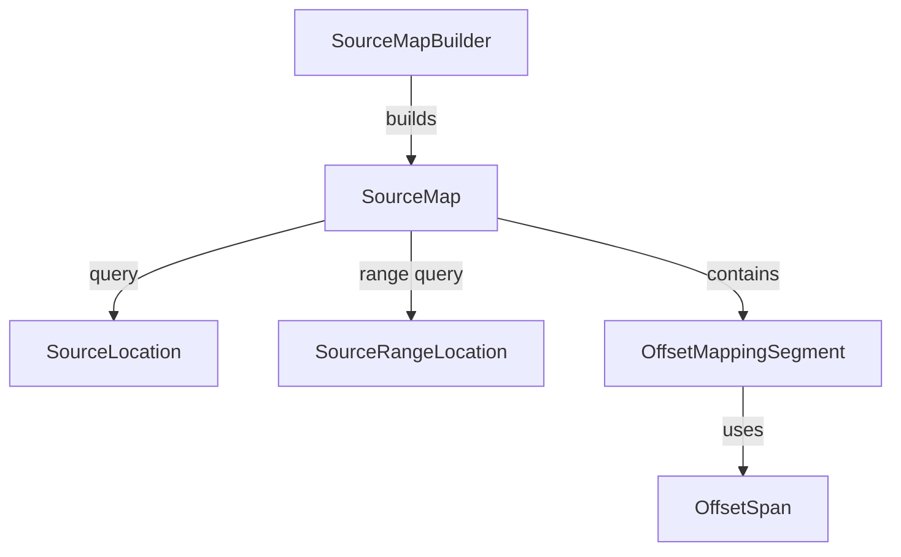

# Source Mapping Architecture

This document describes the offset-based source mapping system that tracks the relationship between generated output offsets and original resource offsets.

## Overview

When multiple resources are merged into a single output, it's crucial to maintain a mapping back to the original sources. TinyPreprocessor uses **0-based offsets** throughout.

This enables:

- Precise diagnostics that can point back to an original resource + offset
- Tooling that can translate slices of generated output to their origin

**Important:** Offsets are measured in **content units**. For the default text pipeline (`TContent = ReadOnlyMemory<char>`), the unit is characters.

## Types

### OffsetSpan

Represents a half-open range of offsets: `[Start, End)`.

```csharp
public readonly record struct OffsetSpan(int Start, int End)
{
    public int Length => End - Start;
}
```

### OffsetMappingSegment

An exact mapping segment between a generated offset span and an original resource offset span.

```csharp
public sealed record OffsetMappingSegment(
    OffsetSpan Generated,
    ResourceId OriginalResource,
    OffsetSpan Original);
```

### SourceLocation

Result of a point query: identifies an original resource and original offset.

```csharp
public sealed record SourceLocation(ResourceId Resource, int OriginalOffset);
```

### SourceRangeLocation

Result of a range query: identifies original and generated spans for an overlapping region.

```csharp
public sealed record SourceRangeLocation(
    ResourceId Resource,
    int OriginalStartOffset,
    int OriginalEndOffset,
    int GeneratedStartOffset,
    int GeneratedEndOffset);
```

### SourceMap

Immutable collection of mapping segments with efficient lookup.

```csharp
public sealed class SourceMap
{
    public SourceLocation? Query(int generatedOffset);
    public IReadOnlyList<SourceRangeLocation> QueryRangeByLength(int generatedStartOffset, int length);
    public IReadOnlyList<SourceRangeLocation> QueryRangeByEnd(int generatedStartOffset, int generatedEndOffset);
}
```

**Design Decisions:**

- **Offset-based**: Simpler and more general than line/column mapping.
- **Exact segments**: Supports precise mapping across resource boundaries.

### SourceMapBuilder

Accumulates mapping segments during merge operations.

```csharp
public sealed class SourceMapBuilder
{
    public void AddOffsetSegment(ResourceId resource, int generatedStartOffset, int originalStartOffset, int length);
    public SourceMap Build();
    public void Clear();
}
```

## Usage During Merge

Merge strategies are responsible for adding mapping segments as they emit content:

```
generatedStart = outputOffset
emit N content units from resource X starting at original offset O
builder.AddOffsetSegment(X, generatedStart, O, length: N)
```

## Query Example

```csharp
var result = await preprocessor.ProcessAsync(root, context);

// Map generated offset 0 back to its origin
var location = result.SourceMap.Query(generatedOffset: 0);

if (location is not null)
{
    Console.WriteLine($"Originated from {location.Resource.Path} at original offset {location.OriginalOffset}");
}

// Query a generated range and map it back to original ranges
var ranges = result.SourceMap.QueryRangeByLength(generatedStartOffset: 0, length: 20);
```

## Relationships



## Thread Safety

- **SourceMap**: Immutable after construction, thread-safe for queries
- **SourceMapBuilder**: Not thread-safe; use one builder per merge operation
