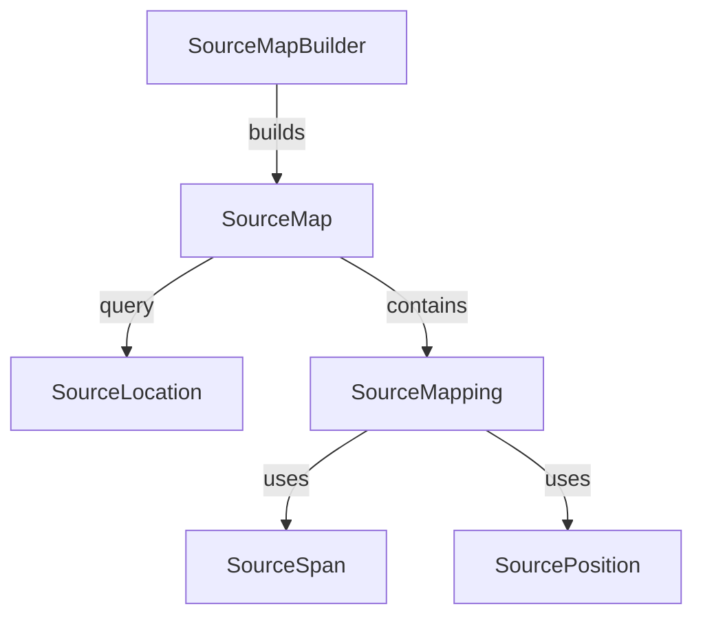

# Source Mapping Architecture

This document describes the source mapping system that tracks the relationship between generated output positions and original resource positions.

## Overview

When multiple resources are merged into a single output, it's crucial to maintain a mapping back to the original sources. This enables:

- Error reporting with original file/line information
- Debugger integration
- IDE "go to definition" functionality
- Accurate diagnostic location reporting

The source map system uses **0-based** line and column numbers internally (matching standard source map conventions).

## Types

### SourcePosition

Represents a position within text content.

```
struct SourcePosition : IEquatable, IComparable
    Properties:
        Line   : int    // 0-based line number
        Column : int    // 0-based column number

    Methods:
        ToOneBased() → (Line + 1, Column + 1)  // for display
        CompareTo(other) → compare by line, then column

    Operators: ==, !=, <, <=, >, >=

    Validation: rejects negative line/column values
```

**Design Decisions:**

- **Readonly struct**: Value semantics, zero allocation on comparison
- **0-based**: Matches standard source map spec; `ToOneBased()` for display
- **IComparable**: Enables binary search in sorted collections
- **Validation**: Negative values rejected at construction

---

### SourceSpan

Represents a range of text from start to end positions.

```
struct SourceSpan : IEquatable
    Properties:
        Start : SourcePosition  // inclusive
        End   : SourcePosition  // exclusive

    Methods:
        Contains(position) → true if position ∈ [Start, End)
        Overlaps(other)    → true if spans intersect

    Validation: End must be >= Start
```

**Design Decisions:**

- **Exclusive end**: Consistent with Range, Span conventions; simplifies math
- **Contains/Overlaps**: Common queries for position lookup

---

### SourceMapping

Maps a span in generated output to a span in an original resource.

```
record SourceMapping(
    GeneratedSpan    : SourceSpan,
    OriginalResource : ResourceId,
    OriginalSpan     : SourceSpan
)
    Methods:
        MapPosition(generatedPos) → SourcePosition?
            // Returns corresponding original position
            // null if generatedPos outside GeneratedSpan

            Algorithm:
                1. Calculate line/column delta from GeneratedSpan.Start
                2. Apply delta to OriginalSpan.Start
                3. Return translated position
```

**Design Decisions:**

- **Sealed record**: Immutable, value equality, readable ToString
- **Span-to-span mapping**: Supports multi-line content blocks
- **MapPosition**: Handles position translation within spans

---

### SourceLocation

Result of a source map query—identifies a position in an original resource.

```
record SourceLocation(
    Resource         : ResourceId,
    OriginalPosition : SourcePosition
)
    // ToString() returns "path/file.txt:25:10" (1-based for display)
```

---

### SourceMap

Immutable collection of mappings with efficient position lookup.

```
class SourceMap
    // Mappings stored sorted by GeneratedSpan.Start for O(log n) lookup

    Properties:
        Mappings : IReadOnlyList<SourceMapping>  // sorted by generated position

    Methods:
        Query(generatedPosition) → SourceLocation?
            // Binary search to find containing mapping
            // Returns original resource + position, or null

        GetMappingsForResource(resourceId) → IEnumerable<SourceMapping>
            // Filter mappings by original resource
```

**Design Decisions:**

- **Sorted mappings**: Enables O(log n) position lookup
- **Binary search**: Efficient for typical source maps (hundreds to thousands of mappings)
- **Immutable**: Built once via SourceMapBuilder, then read-only

---

### SourceMapBuilder

Accumulates mappings during merge operations.

```
class SourceMapBuilder
    Methods:
        AddMapping(mapping)                           → append SourceMapping
        AddSegment(resource, generatedSpan, originalSpan) → convenience wrapper
        AddLine(resource, generatedLine, originalLine)    → single-line mapping

        Build() → SourceMap
            // Sorts mappings by generated position
            // Returns immutable SourceMap

        Clear() → reset accumulated mappings
```

---

## Usage During Merge

```
function Merge(resources, context) → content
    for each resource in resources:
        for each line in resource.Content:
            context.SourceMapBuilder.AddLine(
                resource.Id,
                generatedLine: currentOutputLine,
                originalLine: currentResourceLine
            )
            output.AppendLine(line)

    return output
```

## Query Example

```
// Map error at generated position back to original source
result = preprocessor.ProcessAsync(root, context)

errorPosition = SourcePosition(line: 150, column: 10)
location = result.SourceMap.Query(errorPosition)

if location exists:
    print "Error in {location.Resource.Path} at line {location.Line}, column {location.Column}"
    // Output: "Error in utils/helpers.txt at line 25, column 10"
```

---

## Relationships



## Performance Characteristics

| Operation  | Complexity | Notes            |
| ---------- | ---------- | ---------------- |
| AddMapping | O(1)       | List append      |
| Build      | O(n log n) | Sort by position |
| Query      | O(log n)   | Binary search    |

For typical merged outputs (thousands of lines), queries complete in microseconds.

## Thread Safety

- **SourcePosition, SourceSpan**: Immutable value types, fully thread-safe
- **SourceMapping, SourceLocation**: Immutable records, fully thread-safe
- **SourceMap**: Immutable after construction, fully thread-safe for queries
- **SourceMapBuilder**: **Not thread-safe**; use one builder per merge operation
