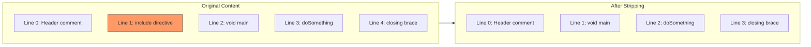
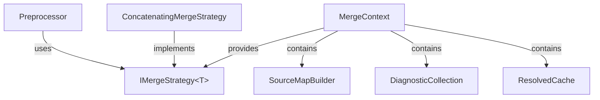

# Merge System Architecture

This document describes the extensible merge system that combines resolved resources into a single output.

## Overview

The merge system is the most customizable part of TinyPreprocessor. While the default behavior is simple concatenation with directive stripping, downstream users can implement sophisticated merge strategies for their specific use cases (e.g., CSS cascade resolution, module bundling, code generation).

## Types

### ResolvedResource

A resource paired with its parsed directives, ready for merging.

```
record ResolvedResource(
    Resource   : IResource,
    Directives : IReadOnlyList<IDirective>
)
    // Convenience properties: Id, Content (delegate to Resource)
```

**Design Decisions:**

- **Sealed record**: Immutable, clear ownership
- **Directives included**: Merge strategies may need directive info (e.g., conditional includes)

---

### MergeContext

Shared context provided to merge strategies for source map building and diagnostics.

```
class MergeContext
    Properties:
        SourceMapBuilder : SourceMapBuilder   // for recording mappings
        Diagnostics      : DiagnosticCollection // for reporting issues
        ResolvedCache    : IReadOnlyDictionary<ResourceId, IResource>  // for cross-referencing
```

**Design Decisions:**

- **SourceMapBuilder**: Merge strategies must record mappings for accurate source tracking
- **Diagnostics**: Merge strategies can report issues (e.g., incompatible content types)
- **ResolvedCache**: Enables strategies to look up related resources

---

### IMergeStrategy<TContext>

Interface for custom merge implementations.

```csharp
public interface IMergeStrategy<in TContext>
{
    /// <summary>
    /// Merges resolved resources into a single output.
    /// Resources are provided in topological order (dependencies first).
    /// </summary>
    /// <param name="orderedResources">Resources sorted by dependency order.</param>
    /// <param name="userContext">User-provided context for strategy customization.</param>
    /// <param name="context">Merge context with source map builder and diagnostics.</param>
    /// <returns>The merged content.</returns>
    ReadOnlyMemory<char> Merge(
        IReadOnlyList<ResolvedResource> orderedResources,
        TContext userContext,
        MergeContext context);
}
```

**Design Decisions:**

- **Generic TContext**: User-defined context for passing strategy-specific options
- **Topological order**: Resources arrive dependencies-first; strategies can rely on this
- **Returns ReadOnlyMemory<char>**: Matches content model; avoids string allocations

---

### ConcatenatingMergeStrategy<TContext>

Default implementation that concatenates resources and strips directives.

```
class ConcatenatingMergeStrategy<TContext> : IMergeStrategy<TContext>
    Options:
        Separator             = "\n"                    // between resources
        IncludeResourceMarkers = false                   // debug markers
        MarkerFormat          = "/* === {0} === */\n"  // marker template

    function Merge(orderedResources, userContext, context) → content
        for each resource in orderedResources:
            if IncludeResourceMarkers:
                output.Append(format(MarkerFormat, resource.Id))

            strippedContent = StripDirectives(resource)
            RecordSourceMappings(resource.Id, strippedContent, context.SourceMapBuilder)
            output.Append(strippedContent)

            if not lastResource:
                output.Append(Separator)

        return output

    function StripDirectives(resource) → content
        // Remove directive text ranges from content
        // Preserve all non-directive content in order
        for each directive in resource.Directives (sorted by location):
            skip content in directive.Location range
        return remaining content

    function RecordSourceMappings(resourceId, content, builder)
        // Map each output line back to original resource line
        for each line in content:
            builder.AddLine(resourceId, outputLine, originalLine)
```

**Design Decisions:**

- **Directive stripping**: By default, directives are removed from output
- **Configurable separators**: Different use cases need different separators
- **Optional markers**: Debug builds may want visible resource boundaries
- **Line-by-line mapping**: Simple but accurate source mapping

---

## Custom Merge Strategy Examples

### CSS Cascade Strategy

```
class CssCascadeMergeStrategy : IMergeStrategy<CssContext>
    function Merge(orderedResources, userContext, context) → content
        // CSS cascade: later rules override earlier ones
        // Topological order ensures base styles come first
        for each resource in orderedResources:
            output.AppendLine("/* Source: {resource.Id} */")
            output.AppendLine(StripImports(resource))
            RecordMappings(...)
        return output
```

### Module Bundler Strategy

```
class ModuleBundleMergeStrategy : IMergeStrategy<BundleOptions>
    function Merge(orderedResources, options, context) → content
        // Wrap each module in IIFE for isolation
        output.AppendLine("(function(modules) {")
        output.AppendLine("  var cache = {};")
        output.AppendLine("  function require(id) { /* loader */ }")

        for each resource in orderedResources:
            output.AppendLine("  modules['{resource.Id}'] = function(exports, require) {")
            output.AppendLine(StripImports(resource))
            output.AppendLine("  };")

        output.AppendLine("})({});")
        return output
```

### Conditional Include Strategy

```
class ConditionalMergeStrategy : IMergeStrategy<Dictionary<string, bool>>
    function Merge(orderedResources, defines, context) → content
        for each resource in orderedResources:
            // Check #ifdef directives against defines map
            shouldInclude = all IfDefDirectives satisfied by defines

            if shouldInclude:
                output.AppendLine(StripDirectives(resource))

        return output
```

---

## Directive Stripping

The default behavior strips directives from output. This is handled by examining `IDirective.Location`:



**Example transformation:**

- **Original Line 1**: `#include "utils.h"` → _Removed (directive)_
- **Original Line 2**: `void main() {` → **New Line 1**
- **Original Line 3**: `doSomething();` → **New Line 2**

**Source mapping considerations:**

- Line numbers shift after directive removal
- The `ConcatenatingMergeStrategy` accounts for this in mapping generation

---

## Relationships



## Extension Points

1. **Custom TContext**: Pass strategy-specific options (defines, output format, etc.)
2. **Custom IMergeStrategy**: Complete control over merge behavior
3. **Directive-aware merging**: Access to parsed directives for conditional processing
4. **Source map customization**: Full control over mapping granularity

## Thread Safety

- **ResolvedResource**: Immutable record, fully thread-safe
- **MergeContext**: Contains mutable builders; not thread-safe
- **IMergeStrategy implementations**: Should be stateless or document thread-safety
- **ConcatenatingMergeStrategy**: Stateless (properties are init-only), thread-safe
