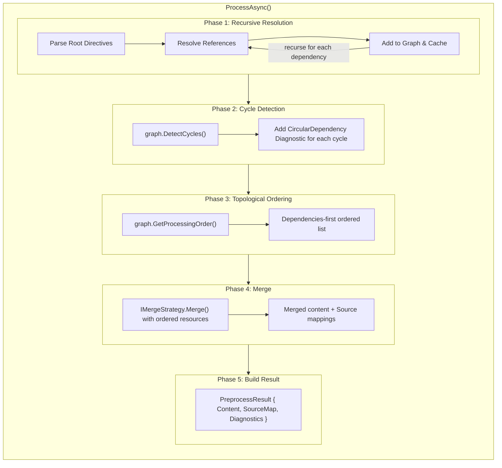

# Preprocessor Orchestrator Architecture

This document describes the main `Preprocessor` class that orchestrates the entire preprocessing pipeline.

## Overview

The `Preprocessor<TContent, TDirective, TContext>` class is the primary entry point for consumers. It coordinates:

1. Recursive resource resolution
2. Directive parsing
3. Dependency graph construction
4. Cycle detection
5. Topological ordering
6. Merge strategy execution
7. Source map generation

## Types

### PreprocessorOptions

Configuration options for preprocessing behavior.

```
record PreprocessorOptions
    DeduplicateIncludes : bool = true   // include each resource only once
    MaxIncludeDepth     : int  = 100    // safety limit against infinite recursion
    ContinueOnError     : bool = true   // collect all diagnostics vs. stop at first

    static Default : PreprocessorOptions  // default instance
```

**Design Decisions:**

- **Sealed record**: Immutable, with-expressions for modification
- **Sensible defaults**: Works out-of-box for common cases
- **DeduplicateIncludes**: Prevents duplicate content (like `#pragma once`)
- **MaxIncludeDepth**: Safety limit against infinite recursion

---

### PreprocessResult

The result of preprocessing, containing merged output and metadata.

```
record PreprocessResult
    Properties:
        Content            : TContent                      // merged output
        SourceMap          : SourceMap                     // position mappings
        Diagnostics        : DiagnosticCollection          // all collected diagnostics
        ProcessedResources : IReadOnlyList<ResourceId>     // in topological order
        DependencyGraph    : ResourceDependencyGraph       // for downstream analysis
```

**Design Decisions:**

- Prefer checking `Diagnostics.HasErrors` for a quick "usable output" signal
- **ProcessedResources**: Useful for cache invalidation, dependency tracking
- **DependencyGraph exposed**: Enables downstream analysis (affected files, etc.)

---

### Preprocessor<TContent, TDirective, TContext>

The main orchestrator class.

```
class Preprocessor<TContent, TDirective, TContext>
    Dependencies:
        parser        : IDirectiveParser<TContent, TDirective>
        directiveModel: IDirectiveModel<TDirective>
        resolver      : IResourceResolver<TContent>
        mergeStrategy : IMergeStrategy<TContent, TDirective, TContext>
        contentModel  : IContentModel<TContent>

    function ProcessAsync(root, context, options?, ct) → PreprocessResult
        options ← options ?? PreprocessorOptions.Default

        // Initialize per-call state
        diagnostics ← new DiagnosticCollection()
        graph ← new ResourceDependencyGraph()
        cache ← new Dictionary<ResourceId, ResolvedResource>()
        sourceMapBuilder ← new SourceMapBuilder()

        // Phase 1: Recursive resolution
        await ResolveRecursiveAsync(root, depth: 0, ...)

        // Phase 2: Cycle detection
        DetectAndReportCycles(graph, diagnostics)

        // Phase 3: Topological ordering
        processingOrder ← GetProcessingOrder(graph, diagnostics)

        // Phase 4: Merge
        mergeContext ← new MergeContext(sourceMapBuilder, diagnostics, cache, directiveModel, contentModel)
        orderedResources ← processingOrder.Select(id → cache[id])
        mergedContent ← mergeStrategy.Merge(orderedResources, context, mergeContext)

        // Phase 5: Build result
        return new PreprocessResult(mergedContent, sourceMapBuilder.Build(), ...)
```

---

## Processing Pipeline



---

## Per-Call Caching

The preprocessor uses a per-call cache to:

1. Prevent redundant resolution of the same resource
2. Enable deduplication (when `DeduplicateIncludes = true`)
3. Provide the resolved cache to merge strategies

```
// Cache structure
cache : Dictionary<ResourceId, ResolvedResource>

// On resolution
if cache.ContainsKey(resource.Id):
    return  // Skip - already resolved

// After parsing
cache[resource.Id] = ResolvedResource(resource, directives)
```

**Cache vs. DeduplicateIncludes:**

- Cache is always populated (tracks what's been seen)
- `DeduplicateIncludes` controls whether duplicate references cause re-processing
- When `DeduplicateIncludes = false`, resources may appear multiple times in output

---

## Include Convention (via IDirectiveModel)

For the preprocessor to know which directives represent dependencies, provide an `IDirectiveModel<TDirective>`.
This model extracts a `string` reference for directives that should trigger recursive resolution.

---

## Error Handling Strategy

The preprocessor follows the "collect all, decide later" pattern:

```
// Resolution error → add diagnostic, continue (if ContinueOnError)
if resolution failed:
    diagnostics.Add(error)
    if not options.ContinueOnError: return

// Cycle detected → add diagnostic, continue
// (output may be incomplete but user sees all issues)

// Max depth exceeded → add diagnostic, stop recursion for that branch
```

**Rationale:**

- Users see ALL problems at once, not just the first
- Enables IDE-style error lists
- Partial results may still be useful (e.g., syntax highlighting)

---

## Usage Example

```
// 1. Create components
parser   = new CStyleIncludeParser()
resolver = new FileSystemResolver("/project/src")
merger   = new ConcatenatingMergeStrategy<object>()

// 2. Create preprocessor
preprocessor = new Preprocessor<IncludeDirective, object>(parser, resolver, merger)

// 3. Load root resource
root = new Resource("main.c", ReadFile("/project/src/main.c"))

// 4. Process
result = await preprocessor.ProcessAsync(root, context: null)

// 5. Check results
if result.Success:
    WriteFile("/project/out/bundle.c", result.Content)
else:
    for each error in result.Diagnostics.GetBySeverity(Error):
        print "[{error.Code}] {error.Resource}: {error.Message}"

// 6. Use source map for error mapping
runtimeError = SourcePosition(line: 150, column: 10)
originalLocation = result.SourceMap.Query(runtimeError)
if originalLocation exists:
    print "Error originated in: {originalLocation}"
```

---

## Thread Safety

- **Preprocessor**: Thread-safe for concurrent `ProcessAsync` calls (each call has isolated state)
- **Per-call state**: Cache, graph, diagnostics are isolated per call
- **Dependencies**: Parser, resolver, merger should be thread-safe or documented otherwise

---

## Extension Points

1. **Custom IDirectiveParser**: Parse any directive syntax
2. **Custom IResourceResolver**: Load from any source (files, network, database)
3. **Custom IMergeStrategy**: Control how resources combine
4. **PreprocessorOptions**: Tune behavior for specific use cases
5. **IDirectiveModel**: Define custom include semantics
